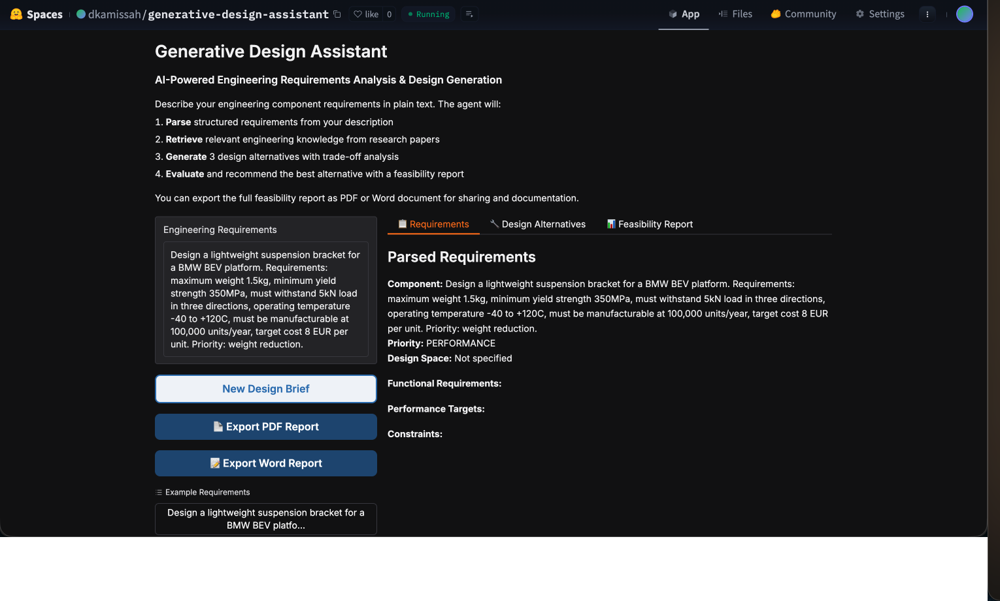
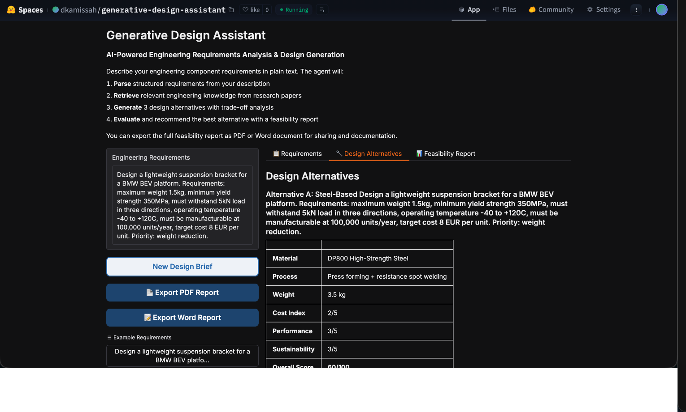
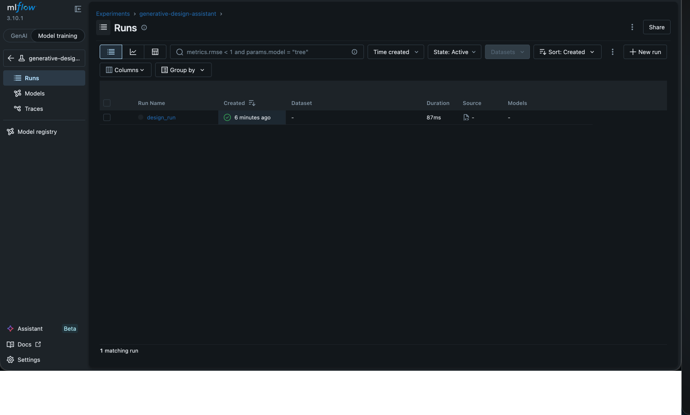
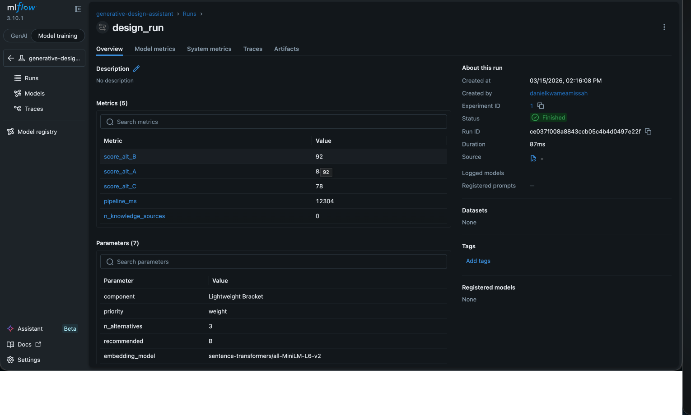

# Generative Design Assistant

**LangChain-style agent for AI-powered engineering requirements analysis and generative design — arXiv + Semantic Scholar ingestion, ChromaDB knowledge base, 4-tool agent pipeline, PDF + Word export, MLflow tracking, CI/CD via GitHub Actions**

[](https://python.org/)
[](https://huggingface.co/spaces/dkamissah/generative-design-assistant)
[](https://mlflow.org/)

---

## 🔴 Live Demo

**[huggingface.co/spaces/dkamissah/generative-design-assistant](https://huggingface.co/spaces/dkamissah/generative-design-assistant)**

Describe an engineering component in plain text — the agent parses requirements, retrieves relevant research, generates 3 design alternatives, evaluates them, and produces a downloadable feasibility report in PDF and Word format.

---

## Overview

An end-to-end agentic AI system that automates engineering feasibility analysis for automotive components. Inspired by BMW Group's Generative Design initiative, the system takes free-text engineering requirements and produces structured design alternatives with trade-off analysis, scoring, and a full feasibility report — all grounded in peer-reviewed research papers.

The agent orchestrates 4 specialised tools in sequence, with MLflow tracking every design session and GitHub Actions CI/CD ensuring code quality and automatic deployment.

---

## Live Screenshots

### Requirements Parsing + Design Alternatives





### MLflow Experiment Tracking





---

## Architecture

```
Free-text Engineering Requirements
            │
            ▼
┌─────────────────────────────┐
│  Tool 1: Requirements Parser │  LLM extracts structured specs from natural language
│  (Mistral-7B / Ollama)       │  component, targets, constraints, priority
└────────────┬────────────────┘
             │
             ▼
┌─────────────────────────────┐
│  Tool 2: Knowledge Retriever │  ChromaDB semantic search over 211 chunks
│  (sentence-transformers)     │  from arXiv + Semantic Scholar papers
└────────────┬────────────────┘
             │
             ▼
┌─────────────────────────────┐
│  Tool 3: Design Generator    │  LLM generates 3 design alternatives
│  (Mistral-7B / Ollama)       │  material, process, weight, cost, sustainability
└────────────┬────────────────┘
             │
             ▼
┌─────────────────────────────┐
│  Tool 4: Feasibility         │  LLM scores and ranks alternatives
│  Evaluator + Report          │  exports PDF + Word feasibility report
└────────────┬────────────────┘
             │
             ▼
┌─────────────────────────────┐
│  MLflow Tracking             │  Logs parameters, metrics, report artifact
│  FastAPI + Gradio            │  REST API + web UI
└─────────────────────────────┘
```

---

## Knowledge Base

**211 document chunks** from real research papers crawled across two sources:

| Source               | Queries                                                                                                                    | Papers      |
| -------------------- | -------------------------------------------------------------------------------------------------------------------------- | ----------- |
| arXiv API            | 8 queries: generative design, topology optimisation, lightweight structures, AM, surrogate models, CFRP, aluminium, FEA+ML | ~240 papers |
| Semantic Scholar API | 5 queries: generative design, topology optimisation, automotive lightweighting, DfM, structural AI                         | ~100 papers |

Papers deduplicated by title and arXiv ID → chunked into 800-word overlapping windows → embedded with `sentence-transformers/all-MiniLM-L6-v2` → stored in ChromaDB.

**Weekly refresh** via GitHub Actions scheduled workflow — automatically re-ingests latest papers every Sunday and redeploys to HF Spaces.

---

## MLflow Tracking

Every design session logged with full parameter and metric tracking.

**Parameters logged:** component name, priority, n_alternatives, recommended alternative, embedding model, LLM model, top_k

**Metrics logged:** score_alt_A, score_alt_B, score_alt_C, pipeline_ms, n_knowledge_sources

**Artifact:** full feasibility report JSON

---

## CI/CD Pipeline

Three GitHub Actions workflows:

| Workflow        | Trigger                            | What it does                                   |
| --------------- | ---------------------------------- | ---------------------------------------------- |
| `ci.yml`      | Every push/PR                      | Lint with ruff + 6 smoke tests (no LLM needed) |
| `cd.yml`      | Push to master (after CI passes)   | Auto-deploy to HF Spaces                       |
| `refresh.yml` | Weekly (Sunday 02:00 UTC) + manual | Re-ingest papers, commit vectorstore, redeploy |

---

## Sample Output

**Input:** *"Design a lightweight suspension bracket for a BMW BEV platform. Max weight 1.5kg, min yield strength 350MPa, 100,000 units/year, target cost €8."*

**Alternative A:** DP800 High-Strength Steel — Press forming + RSW — 3.5kg — Cost 2/5 — Score 60/100

**Alternative B:** 6061-T6 Aluminium — Extrusion + SPR joining — 2.3kg — Cost 3/5 — Score 75/100 ⭐

**Alternative C:** AlSi10Mg AM — LPBF — 1.4kg — Cost 5/5 — Score 85/100

**Recommended:** Alternative B — best balance of weight, cost, and manufacturability at 100k units/year.

**Exports:** PDF feasibility report + Word document with colour-coded tables, executive summary, next steps.

---

## API Endpoints

| Method | Endpoint          | Description             |
| ------ | ----------------- | ----------------------- |
| GET    | `/health`       | Health check            |
| POST   | `/design`       | Run full agent pipeline |
| GET    | `/reports`      | List saved reports      |
| GET    | `/reports/{id}` | Get specific report     |
| GET    | `/docs`         | Swagger UI              |

```bash
curl -X POST http://localhost:8002/design \
  -H "Content-Type: application/json" \
  -d '{"requirements": "Design a lightweight suspension bracket. Max weight 1.5kg. Priority: weight."}'
```

---

## Project Structure

```
generative-design-assistant/
├── app.py                           ← Gradio UI (HF Spaces entry point)
├── configs/config.yaml              ← All settings
├── .github/workflows/
│   ├── ci.yml                       ← Lint + smoke tests
│   ├── cd.yml                       ← Auto-deploy to HF Spaces
│   └── refresh.yml                  ← Weekly knowledge base refresh
├── src/
│   ├── agent/design_agent.py        ← Orchestrates 4 tools + MLflow
│   ├── data/ingest_papers.py        ← arXiv + Semantic Scholar crawler
│   ├── tools/
│   │   ├── requirements_parser.py   ← LLM requirements extraction
│   │   ├── knowledge_retriever.py   ← ChromaDB semantic search
│   │   ├── design_generator.py      ← LLM design alternative generation
│   │   ├── feasibility_evaluator.py ← LLM scoring + report generation
│   │   ├── pdf_exporter.py          ← ReportLab PDF generation
│   │   └── docx_exporter.py         ← python-docx Word generation
│   └── serving/app.py               ← FastAPI REST endpoints
├── knowledge_base/vectorstore/      ← ChromaDB (committed, 211 chunks)
└── outputs/figures/                 ← Screenshots
```

---

## Setup

### Local (Ollama — free)

```bash
git clone https://github.com/danielamissah/generative-design-assistant.git
cd generative-design-assistant
pip install -r requirements.txt

brew install ollama
ollama pull llama3.2:3b
ollama serve   # keep running in separate terminal

make ui        # Gradio at http://localhost:7860
make serve     # FastAPI at http://localhost:8002/docs
make mlflow    # MLflow at http://localhost:5001
```

### Rebuild Knowledge Base

```bash
make ingest    # re-crawl arXiv + Semantic Scholar (~10 min)
```

### HF Spaces Deployment

```bash
git remote add hf https://huggingface.co/spaces/dkamissah/generative-design-assistant
git push hf master
```

Set `HF_TOKEN` as a Space secret and as a GitHub repository secret for CD.

---

## Technologies

LangChain-style agent · ChromaDB · sentence-transformers · Ollama · Mistral-7B · arXiv API · Semantic Scholar API · FastAPI · Gradio · MLflow · ReportLab · python-docx · GitHub Actions · HuggingFace Spaces · Python
